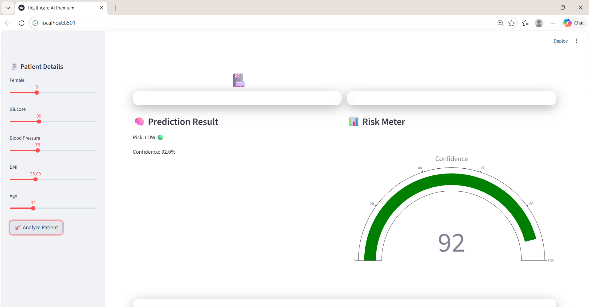
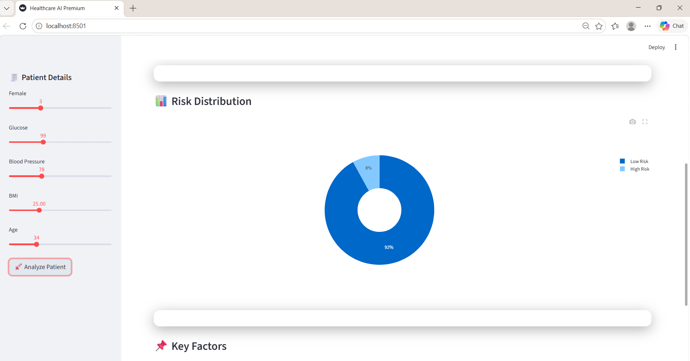
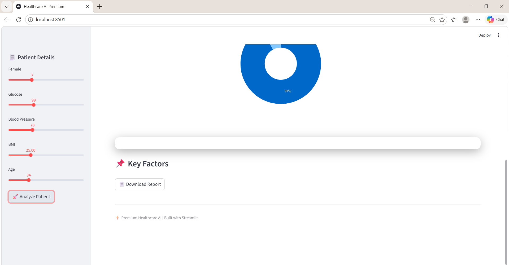

# 🏥 Healthcare Risk Prediction AI
<hr>
 <hr>
<hr>


A **premium AI-powered healthcare web application** that predicts patient risk levels using machine learning and provides interactive visual insights for better decision-making.

---

## 🚀 Features

* 🧠 **Machine Learning Prediction**

  * Predicts patient risk (High / Low)

* 📊 **Interactive Visualizations**

  * Risk Pie Chart
  * Gauge Meter (Confidence Level)

* 🎨 **Premium UI**

  * Glassmorphism design
  * Gradient background
  * Animated cards

* 📌 **Explainability**

  * Displays key risk factors (Glucose, BMI, Age, BP)

* 📄 **Download Report**

  * Export patient risk summary as a file

---

## 🛠️ Technologies Used

* Python
* Streamlit
* Scikit-learn
* Pandas
* Plotly

---

## 📂 Project Structure

```
healthcare-ai/
│── app.py
│── README.md
```

---

## ▶️ How to Run

### 1️⃣ Install Dependencies

```bash
pip install streamlit pandas scikit-learn plotly
```

### 2️⃣ Run Application

```bash
streamlit run app.py
```

### 3️⃣ Open in Browser

```
http://localhost:8501
```

---

## 📊 Input Parameters

* Pregnancies
* Glucose
* Blood Pressure
* BMI
* Age

---

## 📈 Output

* Risk Level (High / Low)
* Confidence Score (%)
* Risk Visualization
* Key Factors

---

## 💡 Example Output

```
Risk: HIGH 🔴
Confidence: 82%

Key Factors:
- High Glucose
- High BMI
- Age Risk
```

---

## ⚠️ Limitations

* Uses sample dataset (not real hospital data)
* Basic explainability (rule-based)
* Not for real medical use

---

## 🔮 Future Enhancements

* 🤖 AI Chatbot for doctors
* 📊 Patient history tracking
* 🔐 Login & authentication
* 🌐 Cloud deployment
* 🧠 Advanced explainability (SHAP)

---

## 👨‍💻 Author

Developed as a **Healthcare AI Project** for learning and demonstration purposes.

---

## ⭐ Conclusion

This project demonstrates how **Machine Learning + UI + Visualization** can be combined to build a smart healthcare assistant that is both **accurate and user-friendly**.

---
